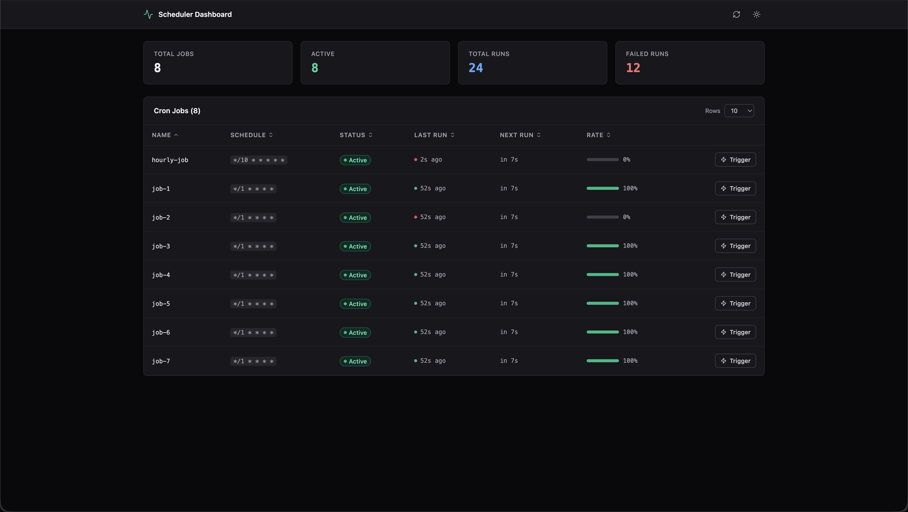
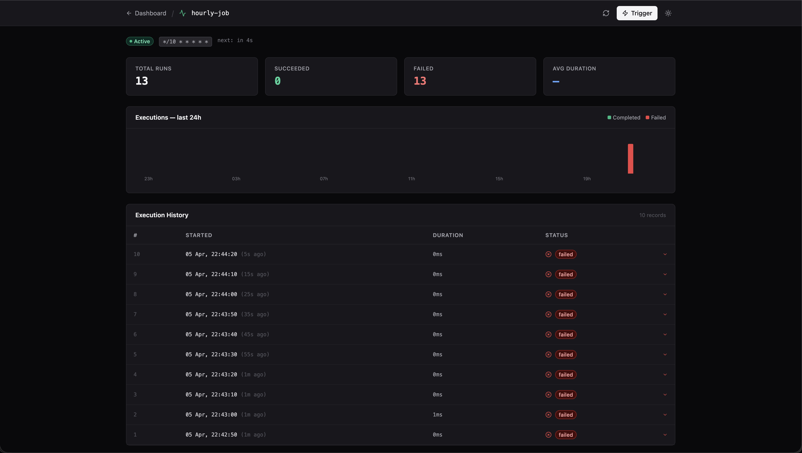

# nestjs-scheduler-dashboard

Monorepo for `@luisrodrigues/nestjs-scheduler-dashboard` — a plug-and-play dashboard for [`@nestjs/schedule`](https://docs.nestjs.com/techniques/task-scheduling).

---

## Preview

**Dashboard - Jobs List**


**Job Detail - Execution History**


---

## Packages

| Package | Description |
|---|---|
| [`packages/scheduler-dash`](./packages/scheduler-dash) | The publishable library — `SchedulerDashModule`, `@TrackJob`, storage abstractions |
| [`packages/scheduler-dash-ui`](./packages/scheduler-dash-ui) | React + Tailwind UI (Vite), built into `src/public/` |
| [`apps/sample`](./apps/sample) | NestJS sample app demonstrating the library in action |

---

## Getting started (library users)

See the [package README](./packages/scheduler-dash/README.md) for full documentation.

```bash
npm install @luisrodrigues/nestjs-scheduler-dashboard
```

```ts
// app.module.ts
import { ScheduleModule } from '@nestjs/schedule';
import { SchedulerDashModule } from '@luisrodrigues/nestjs-scheduler-dashboard';

@Module({
  imports: [
    ScheduleModule.forRoot(),
    SchedulerDashModule.forRoot({ route: '_scheduler' }),
  ],
})
export class AppModule {}
```

```ts
// any job class
@TrackJob(CronExpression.EVERY_HOUR, { name: 'my-job' })
async run() { /* ... */ }
```

Dashboard at `http://localhost:<port>/_scheduler`.

---

## Development

**Prerequisites:** Node.js 18+, pnpm 9+

```bash
pnpm install
```

### Common commands

| Command | Description |
|---|---|
| `pnpm build` | Build the UI then compile the library TypeScript |
| `pnpm dev` | Watch-compile the library TypeScript |
| `pnpm dev:ui` | Start the UI in Vite dev mode |
| `pnpm sample` | Run the sample NestJS app with watch |
| `pnpm sample:build` | Build the library then build the sample webpack bundle |

### Workspace structure

```
nestjs-scheduler-dashboard/
├── apps/
│   └── sample/              # NestJS sample app
├── packages/
│   ├── scheduler-dash/      # Library source (TypeScript)
│   │   └── src/public/      # UI build output (generated — do not edit)
│   └── scheduler-dash-ui/   # React UI (Vite)
├── package.json
└── pnpm-workspace.yaml
```

### Making UI changes

The UI lives in `packages/scheduler-dash-ui/src`. After editing:

```bash
pnpm build
```

This rebuilds the UI into `packages/scheduler-dash/src/public/` and recompiles the library. The `public/` folder is also copied to `dist/public/` for the published package.

### Running the sample

```bash
pnpm sample
```

- App: `http://localhost:3000`
- Dashboard: `http://localhost:3000/_scheduler`

The sample app registers several cron jobs decorated with `@TrackJob`. Click **Trigger** on any job to fire it immediately and see history populate.

---

## How it works

1. `SchedulerDashModule.forRoot(options)` is imported into the host `AppModule`. It provides `JobsService` and a storage instance via NestJS DI.
2. `onModuleInit` sets `SchedulerDashContext.storage` on `globalThis` so `@TrackJob` — which runs as a method decorator outside DI — can write execution records to the same storage instance.
3. `configure(consumer)` (NestJS `NestModule`) registers an Express middleware on `<route>*`. The middleware runs **before** NestJS routing, strips the route prefix, and delegates to an Express router that serves the REST API and the static UI files.
4. `@TrackJob` is a drop-in replacement for `@Cron`. It wraps the method to save executions, enforce no-overlap, and manage concurrency queuing — all through `SchedulerDashContext`.

---

## License

MIT
